## Apuntes de Markown, Github, Git, HTML y CSS- Alexandra Rivas

>## Git
Git es un **Sistema de Control de Versiones** gratuito y de código abierto.

* **¿Para qué sirve?** Git es como una máquina del tiempo para tu código. Te permite registrar cada cambio que haces en tu proyecto, de forma que puedes volver a versiones anteriores, ver quién hizo qué y trabajar en equipo sin sobrescribir el código de nadie.

## 2.  Instalación de Git

Para poder usar los comandos como `git clone` o `git push`, primero debemos instalar Git en tu sistema.
El primer paso es ir al sitio web oficial de Git.

* **Paso a seguir:** Busca **`git-scm.com`** en tu navegador.
* En la página principal, verás la última versión disponible para descargar, lista para Windows (o el sistema operativo que uses).

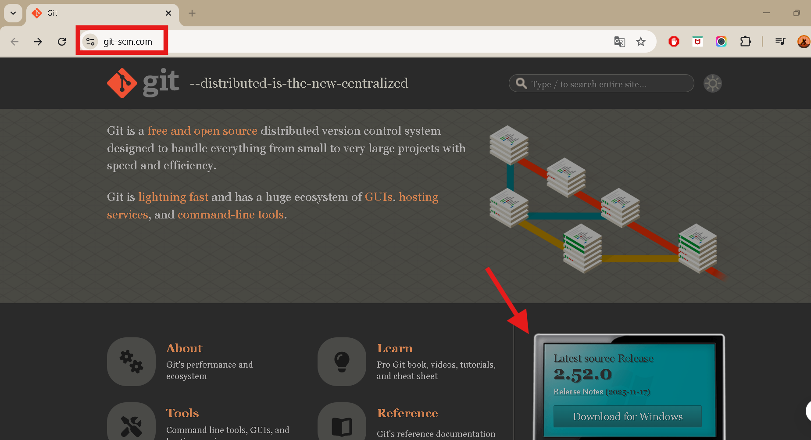  

### Iniciar la Descarga (2 Opciones)

Una vez en la página principal, tienes dos opciones para empezar a descargar el instalador:

1.  Hacer clic directamente en el botón **"Download for Windows"** (o tu sistema operativo).
2.  Hacer clic en la sección de **"Install"** para ver las opciones disponibles para todas las plataformas.

  

### Elegir la Versión 

Una vez que has hecho clic en "Install" o "Download", llegarás a la página de descargas.

* Asegúrate de que la pestaña **Windows** (o tu sistema operativo) esté seleccionada.
* Busca el enlace **"Click here to download"** o la versión que te convenga (normalmente la `x64 version of Git for Windows`), y haz clic para que el instalador (`.exe`) se guarde en tu ordenador.
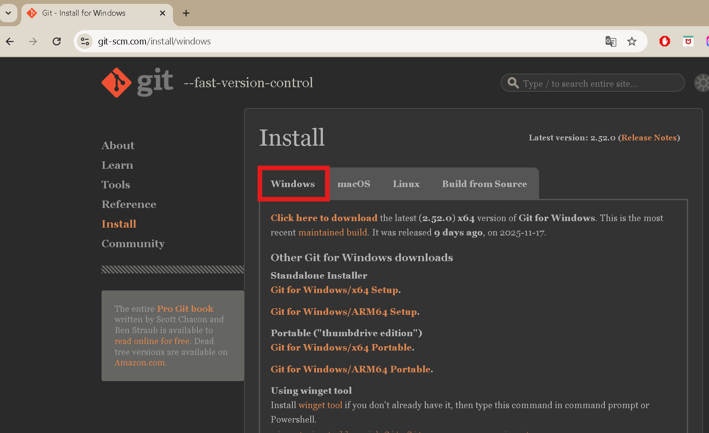 


### Ejecutar el Instalador 

Una vez que has descargado el archivo `.exe`, ejecútalo.

* **Si instalas por `winget`:** Verás cómo el proceso se inicia automáticamente desde PowerShell, y luego se abrirá la ventana gráfica del instalador.
* **Si instalas por doble clic:** Aparecerá directamente la ventana **"Git 2.xx.0 Setup"**.

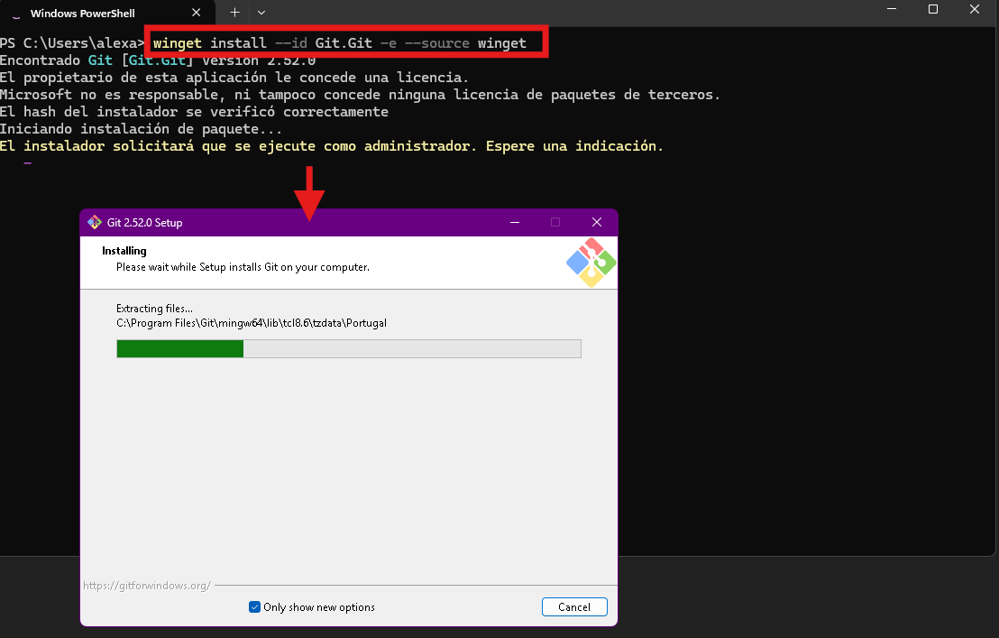

En la ventana de instalación, verás la barra de progreso mientras el programa extrae los archivos necesarios para empezar la configuración.

----

### 4. Verificar la Instalación 

Una vez terminada la instalación, es importante verificar que Git esté listo para usarse, y ver la versión instalada.

* En la terminal (ya sea PowerShell, CMD o Git Bash), ejecuta el siguiente comando:

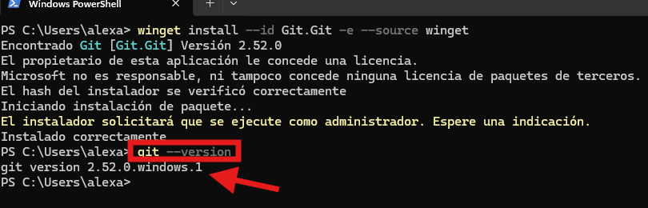


-----

>## Github
### 1. Creación del Repositorio en GitHub

Para comenzar a gestionar tu proyecto, dirígete a la pestaña **"Repositories"** en tu perfil de GitHub y haz clic en el botón verde **"New"** (Nuevo).

Esto te permite crear un espacio de almacenamiento remoto para tu proyecto HTML. Una vez creado, obtendrás una URL única que necesitarás para conectar y sincronizar los archivos desde tu computadora.

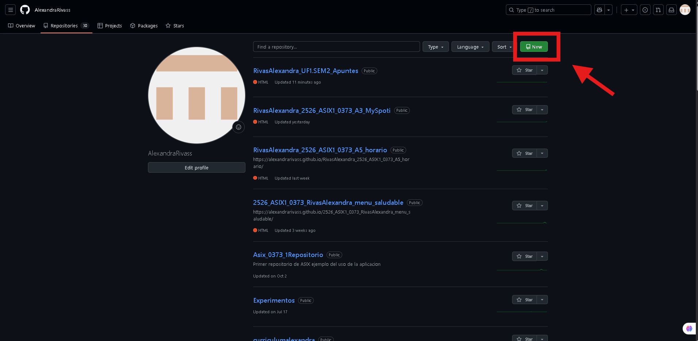  


### 2. Configuración y Finalización del Repositorio

Después de hacer clic en "New", hay que rellenar unos datos importantes para dejar el repositorio listo:

* **Repository name:** Ponle un nombre claro a tu repositorio (lo mejor es usar guiones bajos `_` o guiones `-` en lugar de espacios).
* **Description (Opcional):** Una descripción corta ayuda a saber de qué va el proyecto.
* **Visibility:** Decide si quieres que sea **Public** (visible para todos) o **Private** (solo para ti y quien tú elijas).
* Para terminar, simplemente haz clic en el botón verde **"Create repository"** y ya tendrás tu repositorio remoto creado.
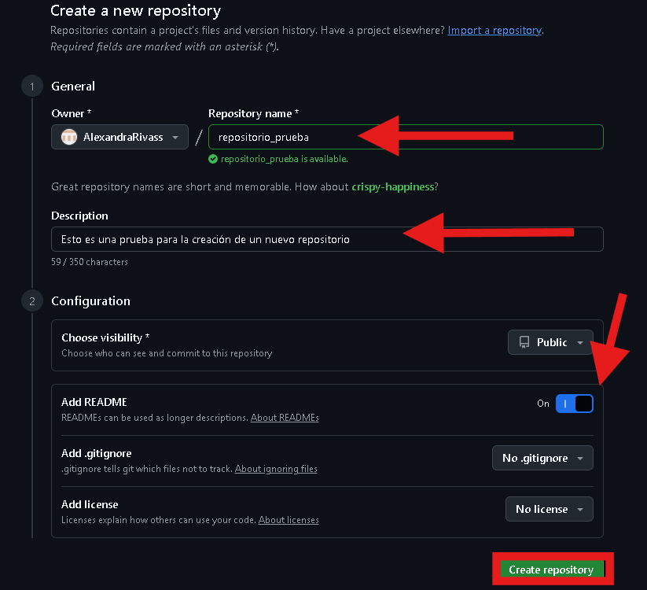

### 3. Obtener la URL de Clonación

Ahora que el repositorio ya está listo en GitHub, necesitamos copiar su dirección para empezar a trabajar en nuestra máquina local.

En la página principal de tu repositorio, tienes que buscar y hacer clic en el botón verde que dice **"<> Code"** (Código). Esto abrirá un pequeño menú desplegable donde encontrarás la **URL HTTPS** que usaremos en la terminal para clonar el repositorio.

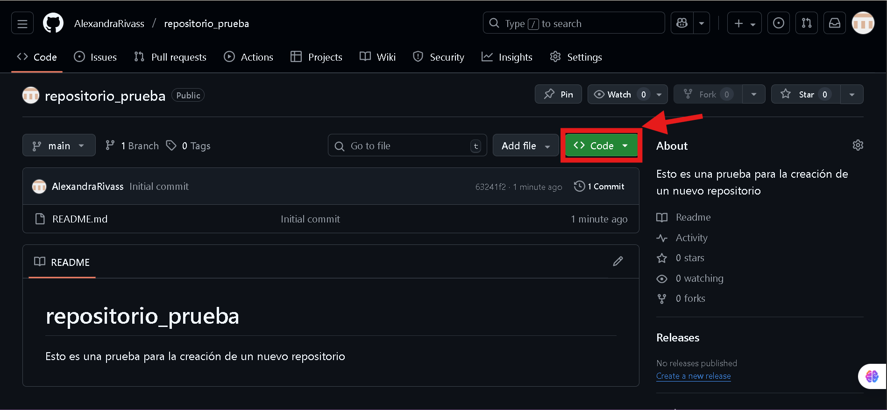


### 4. Copiar la URL HTTPS

Dentro del menú que aparece (al hacer clic en "Code"), asegúrate de que esté seleccionada la opción **HTTPS**.

* Copia la dirección completa que aparece en el recuadro. Esta es la que te permite traer el repositorio a tu máquina usando Git.

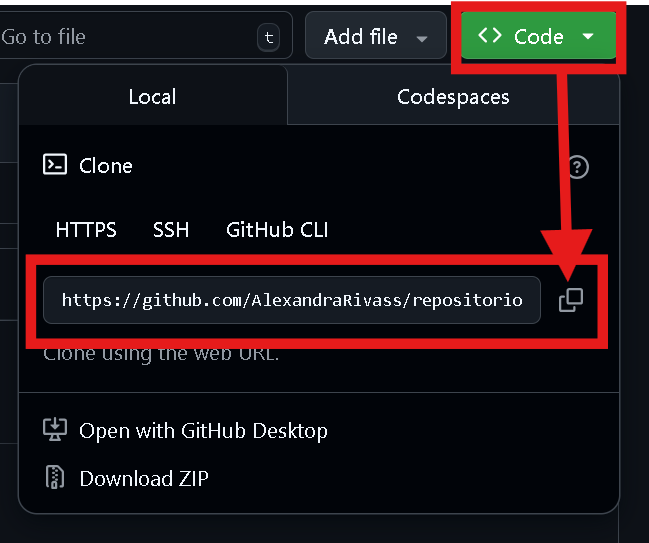

### 5. Preparar la Carpeta Local

Antes de clonar, debes decidir **dónde** quieres guardar el proyecto en tu computadora.

* Usa el explorador de archivos para navegar hasta la carpeta que elijas (en este caso, la carpeta **"Repositorios-GS"**).
* Una vez dentro de esa carpeta en el explorador, deberás abrir la terminal  **en esa misma ubicación** para poder ejecutar el comando de clonación.

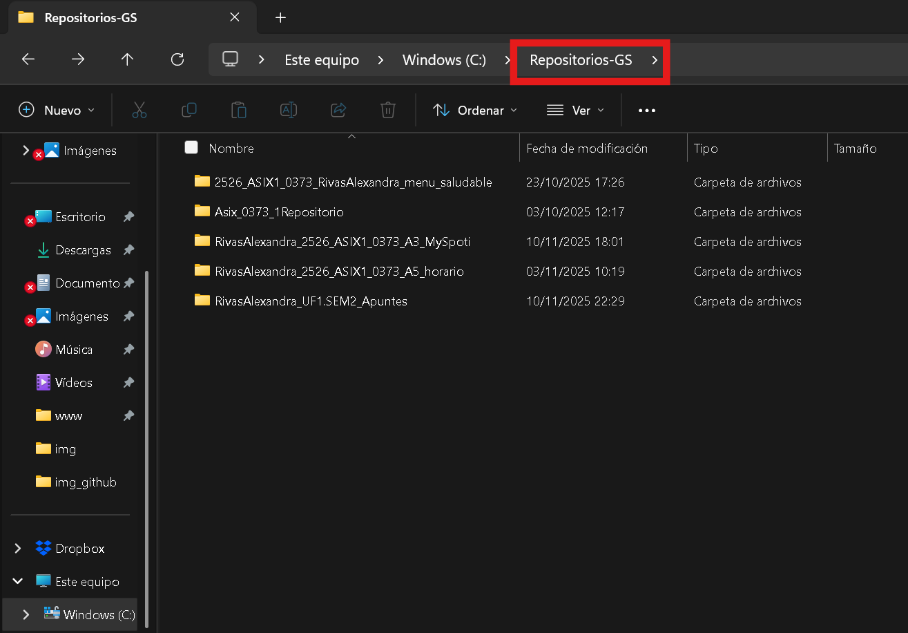

### 6. Ejecutar la Clonación 

Con la terminal abierta en la carpeta correcta, ya puedes usar el comando **git clone** seguido de la URL que copiaste de GitHub.
Al ejecutarlo, la terminal descargará el repositorio (junto con el README.md que creamos) y se creará una nueva carpeta con el nombre del proyecto dentro de tu carpeta local.

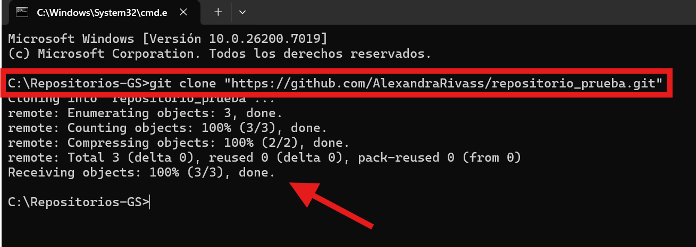 


### 7. Resultado: Repositorio Listo en Local

Una vez que el comando **git clone** ha finalizado, verás que se ha creado una nueva carpeta con el nombre del repositorio (**repositorio_prueba**) dentro de la ubicación que elegiste (la carpeta **Repositorios-GS**).

* **Esta es la carpeta de tu proyecto local.** Ya puedes entrar en ella y haremos las moficaciones en el paso siguiente.
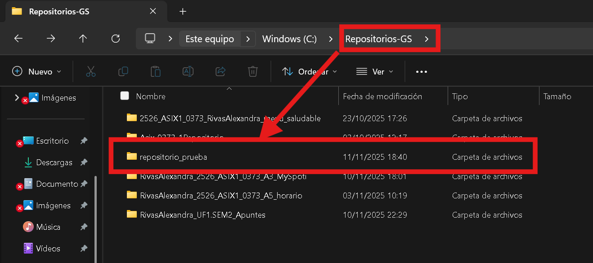

### 8. Abrir la Carpeta en el Editor

Una vez que la carpeta del repositorio (**repositorio_prueba**) ya está en tu máquina, toca abrirla en tu editor de código (VS Code) para empezar a trabajar.

* Simplemente usa la opción **"Open Folder"** o arrastra la nueva carpeta **repositorio_prueba** a la ventana de VS Code.

Desde aquí ya puedes crear o mover tus archivos HTML, CSS, etc., dentro de esa carpeta.

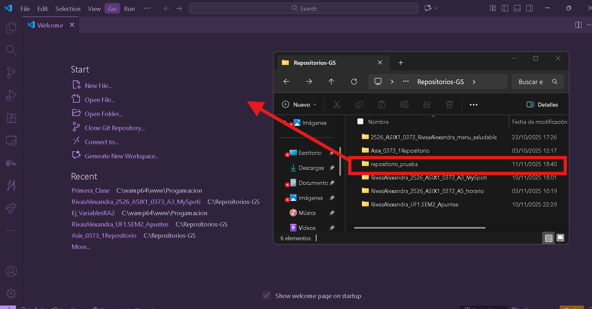

### 9. Crear el Contenido HTML

Una vez que la carpeta del proyecto está abierta en VS Code, puedes crear tus archivos. El ejemplo muestra que hemos añadido el archivo **index.html`** dentro de la carpeta clonada.

* Ahora que hay contenido nuevo, toca usar los comandos de Git para guardar y enviar este trabajo a GitHub.

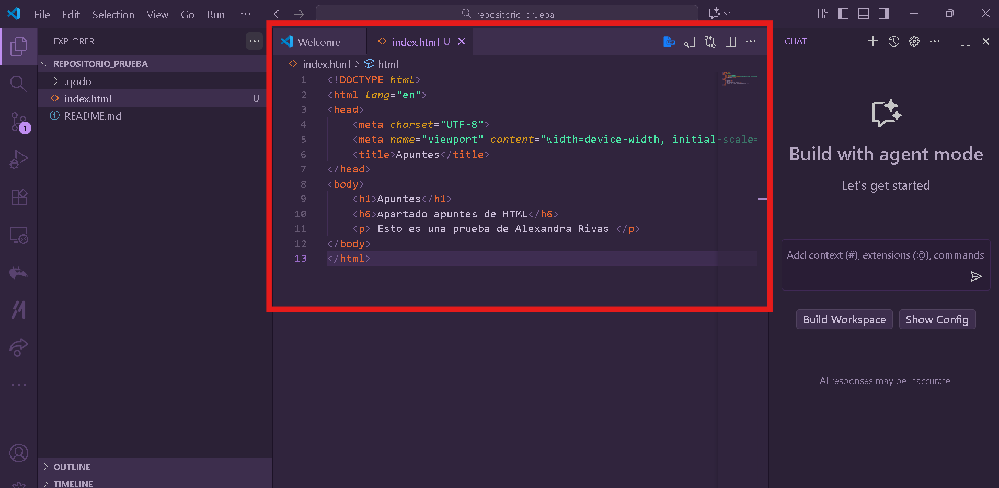

### 10. Archivos Listos en la Carpeta

Si revisas la carpeta del repositorio (**repositorio_prueba**) en tu explorador, verás que el archivo **index.html** ya está guardado ahí.

* Es crucial que los archivos que quieres subir estén dentro de esta carpeta para que Git los pueda rastrear. Ahora sí, vamos a la terminal para enviarlos, habrá que entrar con la ruta del repositorio.

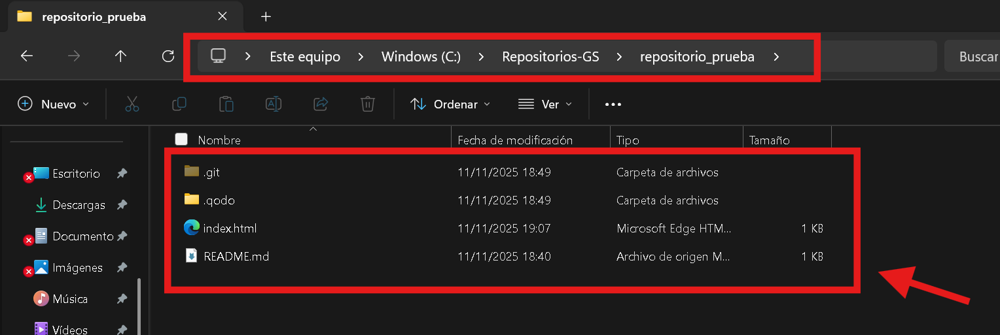


### 11. Ejecución de los Comandos Clave

Una vez dentro de la ruta donde se encuentra el repositorio, ejecutas los comandos en este orden para subir tus archivos a GitHub:

1.  **git init**: Reinicia o verifica la existencia del repositorio de Git en la carpeta 
2.  **git add .**: Prepara todos los archivos que has creado o modificado.
3.  **git commit -m "Mensaje"**: Guarda una versión de tu trabajo y el comentario que has añadido dentro de las comillas. 
4.  **git push**: Envía todo el trabajo guardado al repositorio de GitHub.

Cuando el push termina y ves mensajes de "done", el archivo ya está subido a la plataforma.
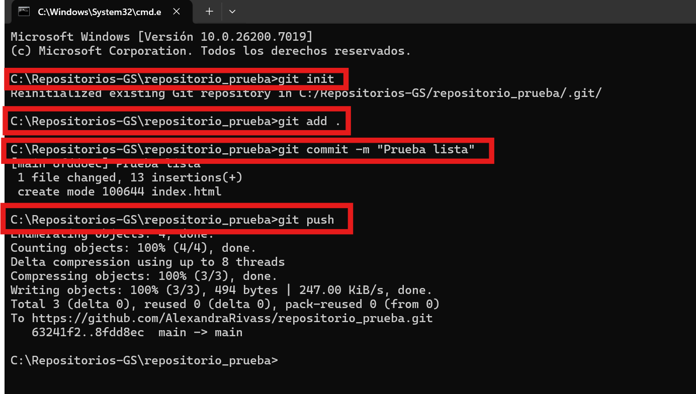  

### 12. Confirmación en GitHub

Para verificar que el **git push** funcionó, solo tienes que actualizar la página de tu repositorio en GitHub.

* Verás que el archivo **index.html** aparece en la lista de archivos.
* El contador de **Commits** (**2 Commits**) habrá aumentado, confirmando que se ha guardado correctamente en el historial del proyecto.
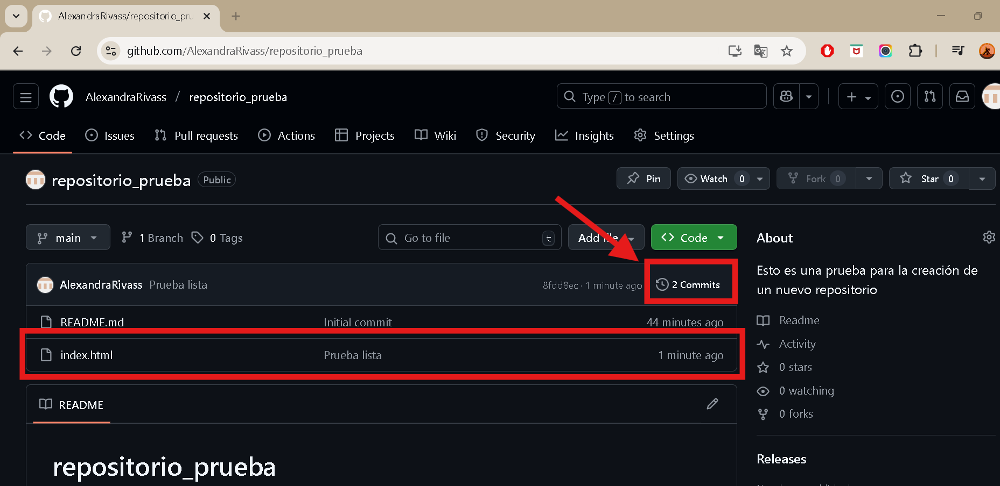   

-----

>## Markdown
## Introducción a Markdown

En esta lección se ofrece una introducción a Markdown, un lenguaje de marcado con sintaxis en texto plano para generar textos con formato. Descubrirás el porqué se utiliza, cómo dar formato a los archivos de Markdown y cómo obtener una vista previa en la web de los documentos formados con Markdown.

Dado que las lecciones de The Programming Historian en español deben ser enviadas como archivos Markdown, hemos incluido ejemplos específicos de PH en la medida de lo posible. Espero que esta guía sea útil si estás considerando contribuir con una lección en este sitio.

## ¿Qué es Markdown?

Markdown es un formato de texto creado en 2004 por **John Gruber**.  
Tiene dos significados principales:
1. Una forma sencilla de **escribir texto con formato** (negritas, listas, títulos, etc.) usando solo caracteres de texto plano.  
2. Una herramienta en **Perl** que convierte archivos Markdown en **HTML**.

En esta lección se estudia la primera acepción: aprender a escribir con la **sintaxis de Markdown**.

Los archivos Markdown son **texto plano**, lo que los hace:
* Compatibles con casi cualquier dispositivo o sistema.
* Más duraderos y fáciles de abrir con el paso del tiempo.
* Legibles directamente, sin necesidad de programas especiales.

Además, muchas plataformas (como **GitHub** o los generadores de sitios estáticos) pueden convertir Markdown a **HTML** automáticamente.  
También existen herramientas como **Pandoc**, que permiten **convertir Markdown a otros formatos** de documento.

--------
## Encabezados

Los encabezados se usan para crear títulos y subtítulos.  
Se definen con el símbolo `#`. Cuantos más `#` uses, más pequeño será el título.
Ejemplo:
```md
# Título 1
## Título 2
### Título 3 
#### Título 4
```
__Se visualiza así:__
# Título 1  
## Título 2  
### Título 3  
#### Título 4

--------------
## Sintaxis general: 

Sirven para aplicar formato visual al texto.  
Se usan asteriscos o guiones bajos para cursiva y negrita.

__Se visualiza así:__
```md
Esto está en __negrita__
Esto está en **negrita** también 

Esto está en _cursiva_
Esto está en *cursiva*

Y ambos es __*TEXTO*__
```
Esto está en __negrita__
Esto está en **negrita** también 

Esto está en _cursiva_
Esto está en *cursiva*

Y ambos es __*TEXTO*__

-------
## Listas

#### Listas ordenadas

Para agregar listas ordenadas en Markdown debes agregar un número seguido de un punto, un espacio y el elemento de la lista. La lista no debe estar ordenada numéricamente, pero debe comenzar por el número

```md
1. Primer elemento
2. Segundo elemento
3. Tercer elemento
```
__Se visualiza así:__

1. Primer elemento
2. Segundo elemento
3. Tercer elemento

#### Listas desordenadas
Para agregar listas no ordenadas en Markdown debes agregar un guion -, un signo más + o un asterisco * delante de los elementos de la lista:

```md
1. Elemento 1
    * Elemento desordenado 1.1
    - Elemento desordenado 1.2
2. Elemento 2
    + Elemento desordenado 2.1
    * Elemento desordenado 2.2
```
__Se visualiza así:__

1. Elemento 1
    * Elemento desordenado 1.1
    - Elemento desordenado 1.2
2. Elemento 2
    + Elemento desordenado 2.1
    * Elemento desordenado 2.2
------
### Links o enlaces
Añadir enlaces a una publicación, más que común, hoy en día es algo casi obligatorio. Con Markdown tendrás varias formas de hacerlo.
#### Enlaces internos
Son los enlaces de toda la vida. Como su nombre indica, se encuentran en línea con el texto.

Se crean escribiendo la palabra o texto enlazada entre [] corchetes, y el link en cuestión entre () paréntesis.
```md
[enlace en línea](https://www.google.com)
```

__Se visualiza así:__
[enlace en línea](https://www.google.com)

------
### Imágenes
Se pueden referir las imágenes mediante el uso de !, seguido de un texto alternativo entre corchetes, seguido a su vez por el URL de la imagen y un título opcional entre comillas. Esto no se representará como texto en tu documento pero te permitirá incluir la imagen en la visualización de una página en HTML.

```md
     

```
__Se visualiza así:__


   


------
### Tablas
Para crear una tabla en GitHub, usa barras verticales | para separar columnas y guiones entre los encabezados y el resto del contenido de la tabla. 
Dado que las barras verticales son sólo estrictamente necesarias entre columnas, puedes usarlas en los extremos de la tabla para darle una vista más acabada. 
Las celdas pueden tener contenido de cualquier extensión, y no es necesario que las barras verticales estén alineadas verticalmente entre sí.

 ```md
| Encabezado 1 | Encabezado 2 | Encabezado 3 |
| --------- | --------- | --------- |
| renglón 1, columna 1 | renglón 1, columna 2 | renglón 1, columna 3|
| renglón 2, columna 1 | renglón 2, columna 2 | renglón 2, columna 3|
| renglón 3, columna 1 | renglón 3, columna 2 | renglón 3, columna 3|
```
__Se visualiza así:__

| Encabezado 1 | Encabezado 2 | Encabezado 3 |
| --------- | --------- | --------- |
| renglón 1, columna 1 | renglón 1, columna 2 | renglón 1, columna 3|
| renglón 2, columna 1 | renglón 2, columna 2 | renglón 2, columna 3|
| renglón 3, columna 1 | renglón 3, columna 2 | renglón 3, columna 3|

Para especificar la alineación del contenido de cada columna se pueden agregar dos puntos :al renglón de los encabezados como sigue:
 ```md
| Alineado-izquierda | Centrado | Alineado-derecha |
| :-------- | :-------: | --------: |
| Manzanas | rojo | 5000 |
| Plátanos | amarillo | 75 |
```
__Se visualiza así:__
| Alineado-izquierda | Centrado | Alineado-derecha |
| :-------- | :-------: | --------: |
| Manzanas | rojo | 5 |
| Plátanos | amarillo | 25 |
------

### Fragmentos de código (snippets)
Representar fragmentos de código en forma distinta al resto del documento es una buena práctica que lo hace más legible. La escritura de código se representa generalmente a espacio sencillo. Dado que Markdown no distingue las tipografías involucradas, representamos los fragmentos de código encerrados entre dos signos de acento grave `. Por ejemplo: `<br/>`. Cuando queremos representar un bloque completo de código lo debemos encerrar entre dos líneas de tres acentos graves. En la ventana de vista previa de StackEdit esto se representará como una caja de texto sombreada y escrita a espacio seguido.

Ejemplo HTML
```html
<html>
    <head>
        <title>Título del sitio Web</title>
    </head>
    <body>
    </body>
</html>
```
Ejemplo de código JavaScript
```js
console.log("Hello world!")
```

------

># Html
## ¿Qué es HTML?
HTML, cuyas siglas significan Lenguaje de Marcado de Hipertexto (Hypertext Markup Languaje), es un lenguaje bastante simple. Consiste en distintos elementos que utilizamos para estructurar una página web.
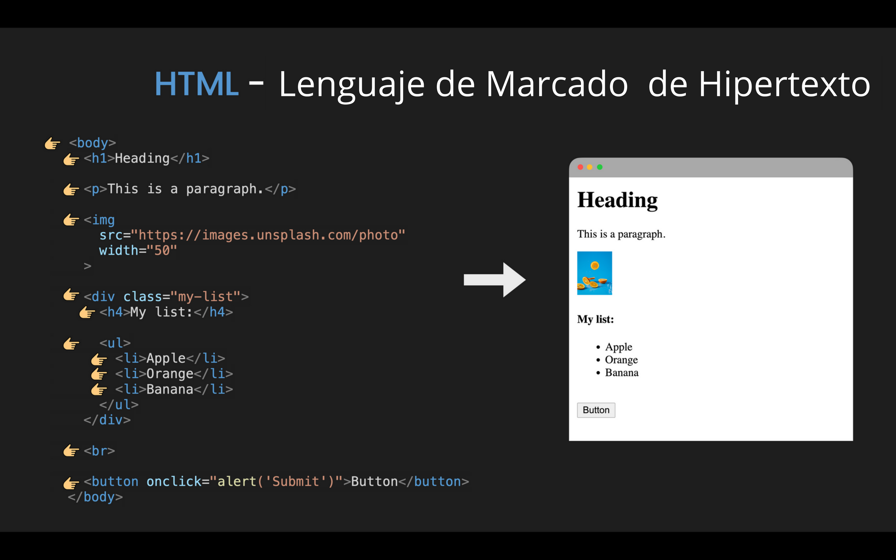   

----
## Estructura básica de un documento HTML
Todo documento HTML sigue una estructura similar. A continuación se muestra un ejemplo básico:

```html
<!DOCTYPE html>
<html lang="es">
<head>
    <meta charset="UTF-8">
    <meta name="viewport" content="width=device-width, initial-scale=1.0">
    <title>Mi primera página web</title>
</head>
<body>
    <h1>¡Hola, mundo!</h1>
    <p>Este es mi primer documento HTML.</p>
</body>
</html>
```
- `<!DOCTYPE html>` - Indica que el documento está escrito en **HTML5**.  
- `<html>` - Es la **etiqueta raíz** que contiene todo el contenido de la página.  
- `<head>` - Contiene **información no visible** directamente (metadatos, título, estilos, etc.).  
- `<body>` - Contiene **todo el contenido visible** para el usuario (textos, imágenes, botones, etc.).

----
## La Cabecera (`<head>`)
- La cabecera contiene información **sobre el documento HTML** y su **configuración**.
- La mayoría de esta información **no se muestra** en la página web (excepto el título).
- Elementos principales dentro de `<head>`:
  - `<title>`: define el **título de la página**, que aparece en la **pestaña del navegador** y al **guardar en favoritos**.
  - `<meta>`: agrega **metadatos**, como charset, descripción o autor.
  - `<link>`: enlaza **recursos externos**, como hojas de estilo CSS.
```html
<!DOCTYPE html>
<html lang="es">
<head>
  <meta charset="UTF-8">
  <title>Mi Página Web</title>
  <link rel="stylesheet" href="styles.css">
</head>
<body>
  <h1>¡Hola, mundo!</h1>
  <p>Este es un ejemplo de página HTML completa.</p>
</body>
</html>
```
__Se visualiza así:__

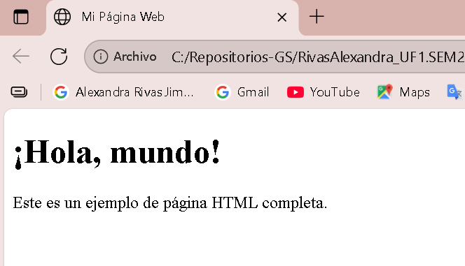  

-----

## BODY  
Esta es la etiqueta más importante, en ella es donde pondremos todo lo que va a salir por pantalla en nuestra web.  
Todo el contenido visible (textos, imágenes, tablas, formularios, etc.) se coloca dentro del `<body>`.
- `<HTML>`  
  Etiqueta que indica que estamos creando una página web.  
  Todo el contenido del documento debe ir dentro de esta etiqueta.

- `<HEAD>`  
  Etiqueta de apertura de la cabecera.  
  En esta parte se incluye información sobre el documento, como el título, autor, enlaces o estilos.  
  Lo único visible en la página es el título, que aparecerá en la pestaña del navegador.

- `</HEAD>`  
  Etiqueta de cierre de la cabecera.

- `<BODY>`  
  Etiqueta de apertura del cuerpo.  
  Aquí va el contenido de la página, que será lo que se vea en el navegador (textos, imágenes, enlaces, etc.).

- `</BODY>`  
  Etiqueta de cierre del cuerpo.

- `</HTML>`  
  Etiqueta de cierre del documento.

```html
<!DOCTYPE html>
<html lang="es">
<head>
    <meta charset="UTF-8">
    <title>Ejemplo de Body</title>
</head>
<body>
    <h1>Contenido dentro del BODY</h1>
    <p>Este texto se muestra porque está dentro de la etiqueta body.</p>
    <p>Aquí podemos poner más elementos, como imágenes o enlaces.</p>
</body>
</html>
```

__Se visualiza así:__

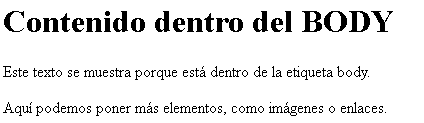   

---
## ¿Qué son los elementos HTML?

El elemento normalmente comienza con una etiqueta de apertura, la cual consiste en el nombre del elemento. Se rodean (Es contenida) por corchetes angulares de apertura y cierre. La etiqueta de apertura indica dónde comienza el elemento.

De igual manera que la etiqueta de apertura, la etiqueta de cierre también está contenida por corchetes angulares de apertura y cierre. Pero también incluye una barra antes del nombre del elemento.

Todo lo que está dentro de las etiquetas de apertura y cierre es el contenido.
```html
<!DOCTYPE html>
<html lang="es">
<head>
    <meta charset="UTF-8">
    <title>Ejemplo de Párrafos</title>
</head>
<body>
    <p>This is a paragraph.</p>
</body>
</html>
```
__Se visualiza así:__

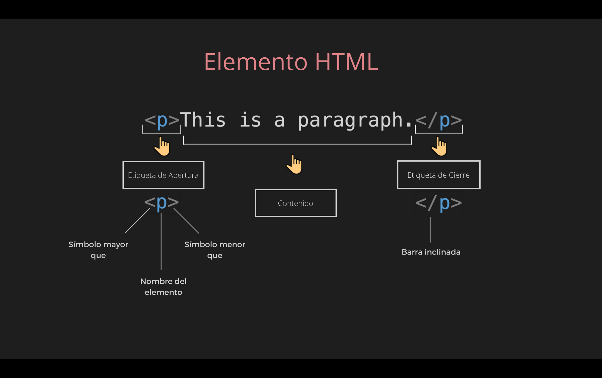   

----

## Comentarios en Html
Los **comentarios** en HTML se utilizan para **incluir notas dentro del código**.  
Sirven para **explicar la lógica**, **dar instrucciones** o simplemente **organizar y clarificar** el código, sin afectar la visualización en el navegador.
```html
<!-- Este es un comentario en HTML -->
```
 ----
 
 ## Organización de los archivos
 Organizar correctamente los archivos y carpetas de un proyecto web es **fundamental** para mantener el código limpio, fácil de entender y escalable.  
Una buena estructura facilita la colaboración y evita confusiones.

```html
.git
readme.md
imagenes
|--- img_html
|--- |--- ejemplo_elementos.png
|--- |--- ejemplo_formulario.png
|--- |--- ...
|--- img_markdown
|--- |--- ejemplo_lista.png
|--- |--- ejemplo_enlace_imagen.png
|--- |--- ...
|--- img_github
|--- |--- ...

```
----

##  Encabezados `<h1>` a `<h6>`
Estas seis etiquetas diferentes se utilizan para hacer encabezados, cada una es mayor que la siguiente, siendo la más pequeña la H6.
Solo se les puede poner un atributo y es la alineación del texto.
Se usan para títulos o subtítulos dentro de una página web.

```html
<!DOCTYPE html>
<html lang="es">
<head>
    <meta charset="UTF-8">
    <title>Ejemplo de Encabezados</title>
</head>
<body>
    <h1>Encabezado H1 - Título principal</h1>
    <h2>Encabezado H2 - Subtítulo</h2>
    <h3>Encabezado H3 - Sección secundaria</h3>
    <h4>Encabezado H4 - Subnivel de detalle</h4>
    <h5>Encabezado H5 - Texto destacado pequeño</h5>
    <h6>Encabezado H6 - Encabezado más pequeño</h6>
</body>
</html>
```

__Se visualiza así:__

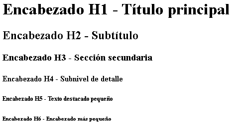  

----

## Listas

En HTML existen **distintos tipos de listas** para organizar información:  

## 1. Lista desordenada (`<ul>`)
- Lista de elementos **sin un orden específico**.  
- **Ejemplo:**
```html
<ul>
  <li>Manzanas</li>
  <li>Naranjas</li>
  <li>Plátanos</li>
</ul>
```
## Lista ordenada (`<ol>`)
- Lista de elementos con orden numérico o alfabético.
- **Ejemplo:**
```html
<ol>
  <li>Preparar ingredientes</li>
  <li>Cocinar</li>
  <li>Servir</li>
</ol>
```
__Se visualiza así:__

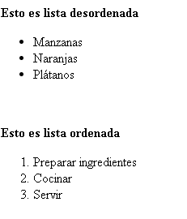  

----
## Elementos de sección
| Elemento | Descripción |
|-----------|-------------|
| `<div>` | Contenedor genérico sin significado semántico. Se utiliza para agrupar contenido o aplicar estilos mediante CSS. |
| `<span>` | Contenedor en línea sin significado semántico. Se usa para aplicar estilos o scripts a partes específicas del texto. |
| `<header>` | Representa el encabezado de una página o sección. Puede incluir el logotipo, título o menús de navegación. |
| `<footer>` | Representa el pie de página de una página o sección. Suele contener información de contacto o derechos de autor. |
| `<nav>` | Define una sección con enlaces de navegación dentro del sitio web. |
| `<main>` | Contiene el contenido principal de la página, excluyendo encabezado, navegación y pie de página. |
| `<section>` | Define una sección temática dentro del documento, con su propio encabezado o contenido relacionado. |


```html
<!DOCTYPE html>
<html lang="es">
<head>
  <meta charset="UTF-8">
  <title>Ejemplo de Elementos de Sección</title>
</head>
<body>

<header>
  <h1>Mi Sitio Web</h1>
  <nav>
    <ul>
      <li><a href="#inicio">Inicio</a></li>
      <li><a href="#servicios">Servicios</a></li>
      <li><a href="#contacto">Contacto</a></li>
    </ul>
  </nav>
</header>

<main>
  <section id="inicio">
    <h2>Bienvenida</h2>
    <p>Contenido introductorio de la página.</p>
  </section>

  <section id="servicios">
    <h2>Servicios</h2>
    <p>Ofrecemos desarrollo web y diseño gráfico.</p>
  </section>
</main>

<footer>
  <p>© 2025 Mi Sitio Web. Todos los derechos reservados.</p>
</footer>

</body>
</html>
```

## Elementos multimedia y enlaces

En HTML, las **imágenes** y los **enlaces** son elementos esenciales para enriquecer el contenido visual y la navegación de una página web.

- El elemento `` se usa para **mostrar imágenes** dentro de un documento HTML.  
- El elemento `<a>` (anchor o ancla) se usa para **crear enlaces** que permiten navegar entre páginas o recursos.

| Elemento | Descripción |
|-----------|-------------|
| `` | Muestra una imagen en la página. No tiene etiqueta de cierre. Requiere el atributo `src` para indicar la ruta de la imagen y `alt` para describirla. |
| `<a>` | Crea un hipervínculo o enlace. Usa el atributo `href` para definir la dirección a la que llevará el clic. Puede enlazar a otras páginas, secciones, archivos o direcciones externas. |


```html
<!DOCTYPE html>
<html lang="es">
<head>
  <meta charset="UTF-8">
  <title>Imágenes y Enlaces en HTML</title>
</head>
<body>

  <h1>Ejemplo de Imágenes y Enlaces</h1>

  <h2> Imagen</h2>
  <p>Ejemplo de cómo insertar una imagen en HTML:</p>
  

  <h2> Enlace</h2>
  <p>Ejemplo de cómo crear un enlace en HTML:</p>
  <a href="https://www.google.com" target="_blank">Visitar Google</a>

  <h2> Imagen dentro de un enlace</h2>
  <p>También puedes usar una imagen como enlace:</p>
  <a href="https://www.wikipedia.org" target="_blank">
    
  </a>
</body>
</html> 
```
__Se visualiza así:__

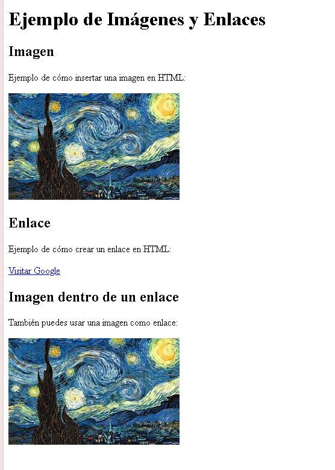  
---
# Tablas en HTML

Las **tablas** en HTML se utilizan para **organizar datos en filas y columnas**.  
Son muy útiles para mostrar información estructurada como listados, horarios, resultados, precios, etc.

El elemento principal es `<table>`, que contiene filas (`<tr>`) y celdas (`<td>`).  
También se pueden usar etiquetas como `<th>` para encabezados y `<caption>` para agregar un título descriptivo.

---

##  Tabla de Elementos de Tabla en HTML

| Elemento | Descripción |
|-----------|-------------|
| `<table>` | Define el inicio y fin de una tabla. Es el contenedor principal. |
| `<tr>` | Representa una fila dentro de la tabla. |
| `<th>` | Define una celda de **encabezado**. El texto suele mostrarse en **negrita** y **centrado** por defecto. |
| `<td>` | Define una celda de **datos** dentro de una fila. |
| `<caption>` | Añade un título o descripción breve a la tabla. Es opcional y se coloca justo después de `<table>`. |
| `<thead>` | Agrupa las filas de encabezado de la tabla. |
| `<tbody>` | Agrupa las filas del cuerpo principal de la tabla. |
| `<tfoot>` | Agrupa las filas del pie de la tabla, normalmente para totales o resúmenes. |


## Tabla sobre `rowspan` y `colspan`

| Atributo | Descripción | Resultado |
|-----------|-------------|------------|
| `rowspan` | Une **varias filas verticalmente** en una sola celda. | La celda ocupa el espacio de varias filas. |
| `colspan` | Une **varias columnas horizontalmente** en una sola celda. | La celda ocupa el espacio de varias columnas. |


```html

<!DOCTYPE html>
<html lang="es">
<head>
  <meta charset="UTF-8">
  <title>Tablas en HTML</title>
  <style>
    table { border-collapse: collapse; width: 60%; margin-bottom: 2rem; }
   
    th, td { border: 1px solid #333; padding: 10px; text-align: center; }
  </style>
</head>
<body>

  <h1>Ejemplo de Tablas en HTML</h1>

  <table><!--Tabla de elementos de tabla -->
    <caption>Listado de Estudiantes</caption><!--Título de la tabla -->
    <thead><!--Encabezado de la tabla -->
      <tr>
        <th>Nombre</th>
        <th>Edad</th>
        <th>Curso</th>
      </tr>
    </thead>
    <tbody><!--Cuerpo de la tabla -->
      <tr>
        <td>Ana López</td>
        <td>20</td>
        <td>HTML Básico</td>
      </tr>
      <tr>
        <td>Carlos Pérez</td>
        <td rowspan="2">22</td> <!-- rowspan: ocupa varias filas ABAJO - ARRIBA-->
        <td>CSS Avanzado</td>
      </tr>
      <tr>
        <td>María Torres</td>
        <td>JavaScript</td>
      </tr>
    </tbody> <!-- Cuerpo de la tabla -->
    <tfoot><!--Pie de la tabla -->
      <tr>
        <td colspan="3">Total de estudiantes: 3</td><!-- colspan: ocupa varias columnas  IZQ - DER.-->
      </tr>
    </tfoot>
  </table>

</body>
</html>
```


__Se visualiza así:__

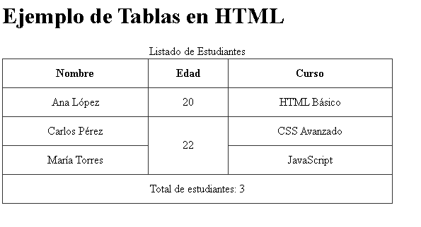  

---
# Formularios en HTML

Los **formularios** en HTML se utilizan para **recoger información de los usuarios**, como nombres, correos, preferencias o comentarios.  
Se componen de distintos campos de entrada y controles interactivos.

El contenedor principal es `<form>`, dentro del cual se usan etiquetas como `<input>`, `<textarea>`, `<select>`, `<fieldset>`, `<legend>`, `<label>` y `<button>`.

---

## Tabla de Elementos de Formularios

| Elemento | Descripción |
|-----------|-------------|
| `<form>` | Contenedor principal del formulario. Atributos importantes: `action` (archivo de destino), `method` (GET o POST), `target` (dónde abrir el resultado). |
| `<label>` | Etiqueta asociada a un campo de entrada mediante el atributo `for`. Mejora accesibilidad y usabilidad. |
| `<input>` | Campo de entrada de datos. Tipos más comunes: `text`, `email`, `password`, `number`, `radio`, `checkbox`, `submit`. |
| `<textarea>` | Área de texto de varias líneas para comentarios o información extensa. |
| `<select>` | Menú desplegable que permite seleccionar una opción. |
| `<option>` | Define cada opción dentro de un `<select>`. |
| `<fieldset>` | Agrupa campos relacionados dentro del formulario. |
| `<legend>` | Título de un `<fieldset>`. |
| `<button>` | Botón interactivo. `type="submit"` envía los datos del formulario. |
| `name` | Identificador del campo que se enviará al servidor. |
| `id` | Identificador único de un campo, usado para asociarlo con `<label>`. |
| `value` | Valor que se enviará si el campo está seleccionado o enviado. |
| `placeholder` | Texto que aparece dentro del campo antes de que el usuario escriba algo. |
| `checked` | Atributo para indicar que un `radio` o `checkbox` está seleccionado por defecto. |
| `required` | Hace que un campo sea obligatorio antes de enviar el formulario. |
 ```html
 <!DOCTYPE html>
<html lang="es">
<head>
    <meta charset="UTF-8">
    <title>Formulario de Contacto</title>
    <style>
        /* Estilo básico para mejor visualización */
        body { font-family: Arial, sans-serif; margin: 2rem; }
        fieldset { margin-bottom: 1rem; } /* Separa los grupos de campos */
        label { display: inline-block; width: 120px; margin-bottom: 5px; } /* Etiquetas alineadas */
        input, select, textarea { margin-bottom: 10px; } /* Espacio debajo de los campos */
    </style>
</head>
<body>

<h1>Formulario de Contacto</h1>

<!--
  <form> Contenedor principal del formulario
  action -> archivo de destino donde se enviarán los datos
  method -> cómo se envían los datos (GET o POST)
-->
<form action="procesar_contacto.html" method="POST">

    <!-- Nombre completo -->
    <label for="nombre">Nombre:</label> <!-- <label> indica a qué campo hace referencia -->
    <input type="text" id="nombre" name="nombre" placeholder="Tu nombre" required>
    <!-- 
      <input type="text"> campo de texto simple
      id -> identificador único, usado con label
      name -> nombre del campo para enviar al servidor
      placeholder -> texto guía dentro del campo
      required -> obliga al usuario a completarlo antes de enviar
    -->
    <br>

    <!-- Correo electrónico -->
    <label for="correo">Correo:</label>
    <input type="email" id="correo" name="correo" placeholder="correo@ejemplo.com" required>
    <!--
      type="email" valida que el usuario introduzca un email correcto
    -->
    <br>

    <!-- Edad -->
    <label for="edad">Edad:</label>
    <input type="number" id="edad" name="edad" min="0" max="120">
    <!--
      type="number" permite solo números
      min / max limitan los valores posibles
    -->
    <br>

    <!-- Género con radio buttons -->
    <fieldset> <!-- Agrupa elementos relacionados -->
        <legend>Género</legend> <!-- Título del grupo de campos -->
        <input type="radio" id="masculino" name="genero" value="masculino">
        <label for="masculino">Masculino</label>
        <!-- type="radio" permite seleccionar solo una opción dentro de un mismo "name" -->

        <input type="radio" id="femenino" name="genero" value="femenino">
        <label for="femenino">Femenino</label>

        <input type="radio" id="otro" name="genero" value="otro">
        <label for="otro">Otro</label>
    </fieldset>

    <!-- Intereses con checkboxes -->
    <fieldset>
        <legend>Intereses</legend>
        <input type="checkbox" id="noticias" name="intereses[]" value="noticias">
        <label for="noticias">Noticias</label>
        <!-- type="checkbox" permite seleccionar múltiples opciones
             name="intereses[]" con [] indica que se enviarán como array al servidor -->

        <input type="checkbox" id="deportes" name="intereses[]" value="deportes">
        <label for="deportes">Deportes</label>

        <input type="checkbox" id="tecnologia" name="intereses[]" value="tecnologia">
        <label for="tecnologia">Tecnología</label>
    </fieldset>

    <!-- País usando select -->
    <label for="pais">País:</label>
    <select id="pais" name="pais">
        <option value="espana">España</option>
        <option value="mexico">México</option>
        <option value="argentina">Argentina</option>
    </select>
    <!-- 
      <select> crea un menú desplegable
      <option> define las opciones posibles
      value -> valor que se enviará al servidor si se selecciona
    -->
    <br>

    <!-- Comentarios usando textarea -->
    <label for="comentarios">Comentarios:</label><br>
    <textarea id="comentarios" name="comentarios" rows="5" cols="40" placeholder="Escribe tus comentarios..."></textarea>
    <!-- 
      <textarea> permite escribir varias líneas de texto
      rows y cols definen tamaño visible
    -->
    <br>

    <!-- Botón para enviar -->
    <button type="submit">Enviar</button>
    <!-- 
      <button> con type="submit" envía los datos del formulario
      Se puede usar text o iconos dentro del botón
    -->
</form>

</body>
</html>
 ```
__Se visualiza así:__

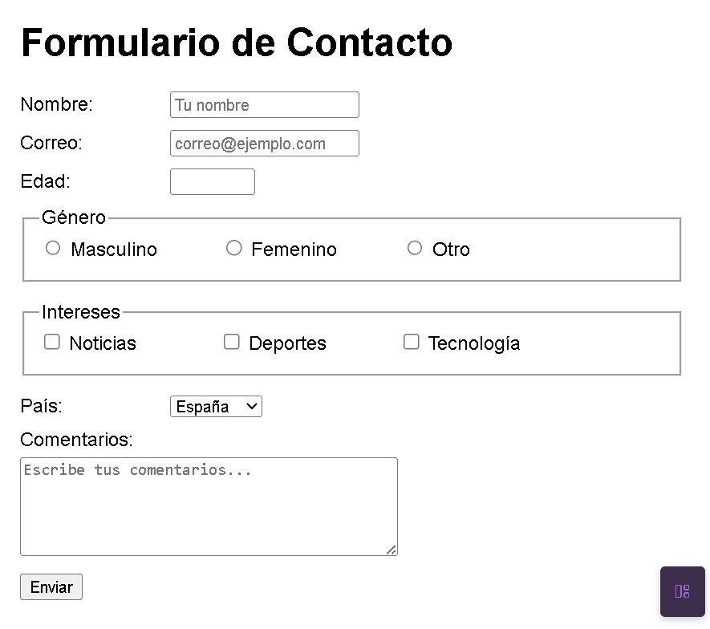  
----
># Validador HTML del W3C

El Validador del W3C es la herramienta oficial para revisar tu código HTML y asegurar que cumple con los estándares web.

### ¿Cómo funciona?

1.  **Objetivo:** Su función es detectar errores (fallos graves) y advertencias (problemas menores) en tu código.
2.  **Importancia:** Usarlo garantiza que tu página sea compatible con la mayoría de navegadores y que el código sea limpio y accesible.
3.  **Resultado:** El objetivo es corregir todo hasta que la herramienta te muestre un resultado positivo (el "Green Pass").

  

-------

### Página Web

Puedes acceder y usar esta herramienta en línea a través de:

* **URL:** `validator.w3.org`
* **Opciones para validar:** Puedes pegar el código directamente, subir un archivo HTML o pegar la URL de una página ya publicada.

#### Opciones de Validación Detalladas

El Validador del W3C te da tres formas para que puedas revisar tu código HTML:

1.  **Validate by URI:** Pegas la dirección (URL) de tu página web si ya la tienes subida a Internet.
2.  **Validate by File Upload:** Subes tu archivo `index.html` (o el que quieras revisar) directamente desde tu ordenador.
3.  **Validate by Direct Input:** Copias y pegas el código HTML completo en el recuadro de texto que aparece en la página.

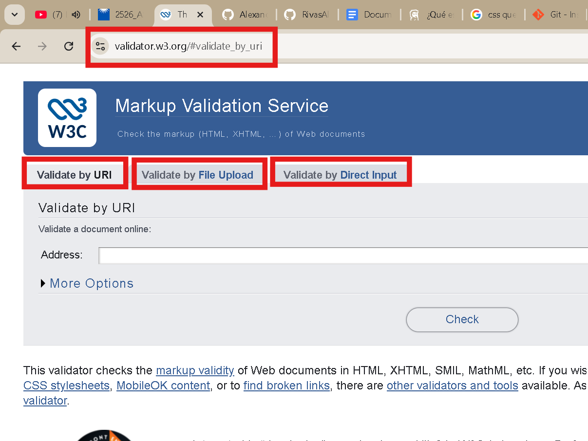  

### Comprobación de código

Si has elegido la opción **"Validate by Direct Input"**, debes pegar tu código HTML completo en el recuadro que aparece.

* En la imagen, se ve cómo se ha pegado el código de la página (incluyendo el `<!DOCTYPE html>`, `<html>`, `<body>`, etc.).
* Una vez que el código está pegado, solo tienes que hacer clic en el botón **"Check"** para que la herramienta lo analice y te muestre los errores.

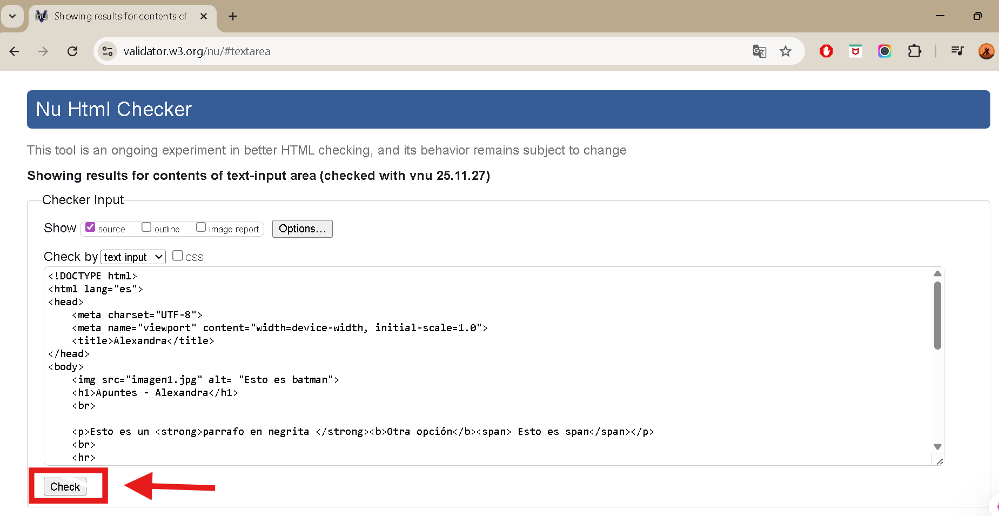  

-------- 

### Resultado Final

Después de hacer clic en "Check", el Validador revisa tu código y te muestra el resultado.

* **La meta:** El objetivo es ver la barra verde que dice **"Document checking completed. No errors or warnings to show."**
* **¿Qué significa?** Tu código HTML es **válido**; cumple con los estándares, es limpio y es compatible con la mayoría de los navegadores.

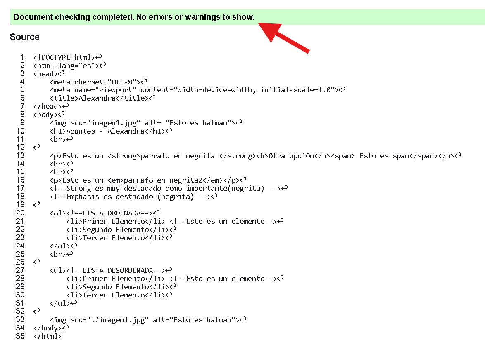  

*(Si hubiese errores, aparecerían detallados en rojo para que puedas corregirlos línea por línea).*

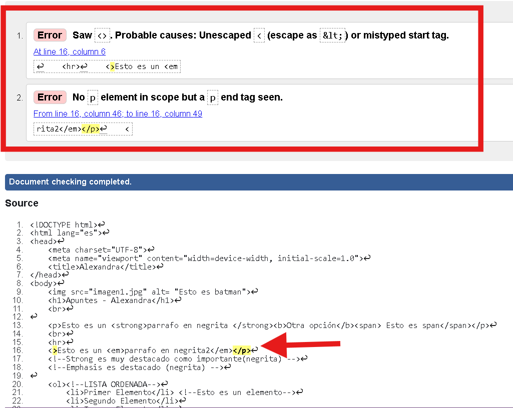  


------
> # css
### Que es css?
Las siglas CSS (Cascading Style Sheets) significan «Hojas de estilo en cascada» y parten de un concepto simple pero muy potente: aplicar estilos (colores, formas, márgenes, etc...) a uno o varios documentos (generalmente documentos HTML, páginas webs) de forma automática y masiva.

Se le denomina estilos en cascada porque se lee, procesa y aplica el código desde arriba hacia abajo (siguiendo patrones como herencia o cascada que trataremos más adelante) y en el caso de existir ambigüedad (código que se contradice), se siguen una serie de normas para resolver dicha ambigüedad.

 

------
### ¿Por qué se usa CSS?
Con el tiempo, separar el código hace que el proyecto sea **mucho más fácil de modificar y mantener**.

* **HTML (Contenido):** Estos documentos solo deben incluir la **información y los datos** a transmitir (títulos, párrafos, imágenes, etc.).
* **CSS (Presentación):** Estos documentos solo deben incluir los aspectos relacionados con el **estilo y diseño** (colores, fuentes, márgenes, formas, etc.).

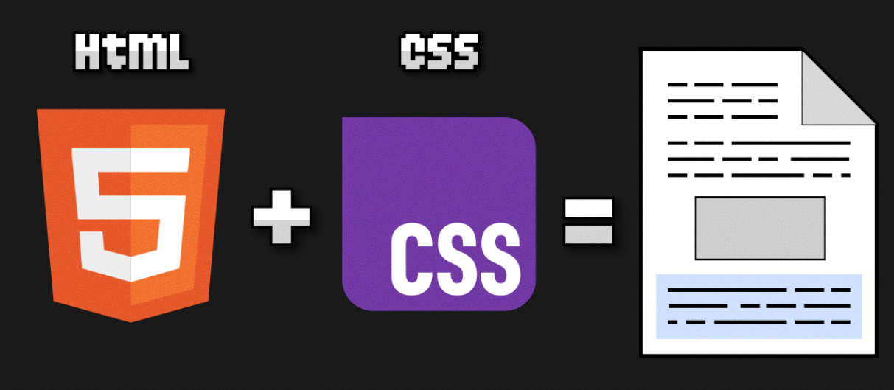 

------

### Google Fonts
### Definición

**Google Fonts** es un servicio de Google que proporciona una **extensa biblioteca de fuentes tipográficas** gratuitas y de código abierto. Esta plataforma está diseñada para facilitar a desarrolladores y diseñadores la integración de tipografías optimizadas en proyectos web (mediante CSS) y también permite la descarga para uso local.

 

------

### Localización y Búsqueda
Puedes acceder a la página principal del servicio aquí:
* [https://fonts.google.com](https://fonts.google.com)

Lo primero es buscar la fuente que queremos usar, por ejemplo, **Roboto**.
* Utilice la barra de búsqueda ubicada en la parte superior de la interfaz para introducir el nombre de la familia tipográfica deseada (ejemplo: **Roboto**).
* La plataforma mostrará inmediatamente los resultados relevantes y le permitirá refinar la búsqueda mediante la opción **"Sort by"** (Ordenar por) o aplicando **"Filters"** (Filtros).

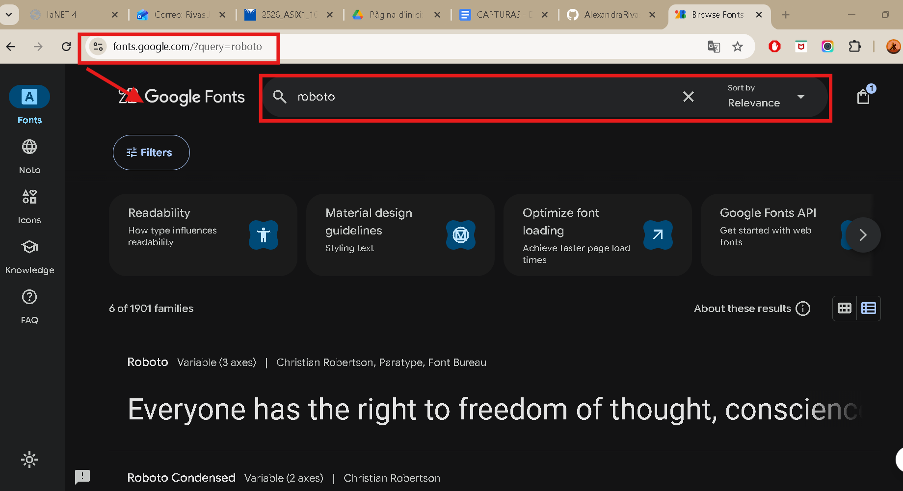 

-------

### Adquisición de la Fuente

Para iniciar el proceso de descarga del paquete tipográfico (**Roboto**), proceda a hacer clic en el botón **"Get font"** (Obtener fuente) situado en la esquina superior derecha de la interfaz. Este comando descargará el archivo ZIP correspondiente.

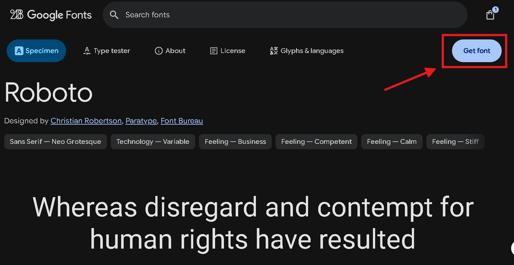 


-----

### Descarga e Integración

Una vez seleccionada la familia tipográfica **(Roboto)**, el usuario dispone de dos opciones principales para su adquisición o uso:

1.  **Get embed code:** Obtiene el código HTML/CSS necesario para la implementación directa de la fuente en un proyecto web.
2.  **Download all (1):** Permite la descarga de los archivos de fuente para su instalación y uso local (offline) en cualquier aplicación de escritorio.

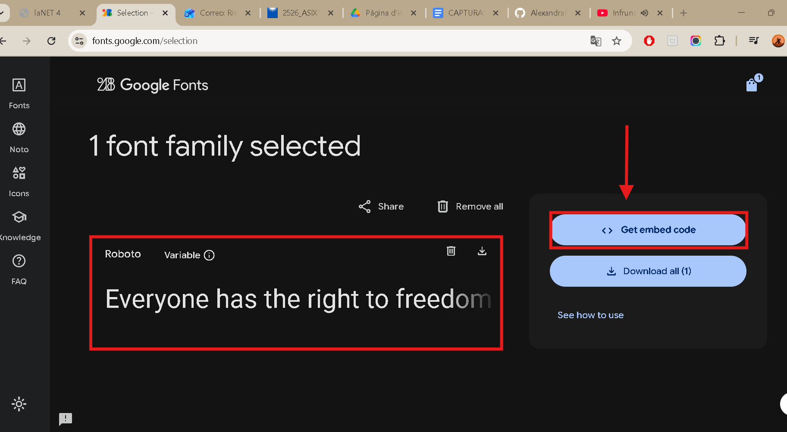 

-----

### Uso del Enlace HTML

Al elegir la opción **"Get embed code"**, se accederá a la sección donde se proporciona el código de inserción.

* **Formato `<link>`:** El código provisto, el cual se presenta como elementos `<link>`, debe ser copiado y pegado dentro de la sección `<head>` de su documento HTML.
* **Activación CSS:** Este paso es indispensable para que la fuente quede correctamente enlazada y pueda ser invocada a través de la propiedad `font-family` en su hoja de estilos CSS.

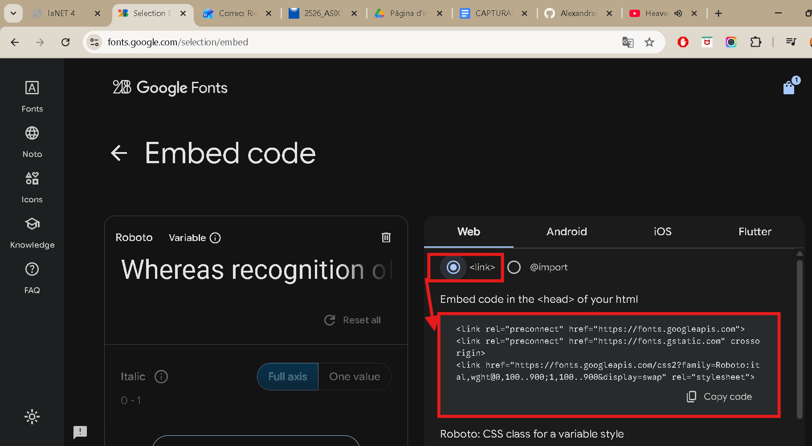 

-----

### Uso del Enlace HTML
### 1. Selección del Método
Dentro de la interfaz de "Embed code" de Google Fonts, seleccione la opción **`@import`** para generar el código de inserción.

### 2. Copia del Código
Copie la URL de importación que se muestra en el recuadro.

> **Prioridad:** Esta URL debe ser la **primera declaración absoluta** en su hoja de estilos CSS, antes de cualquier otra regla de estilo, para asegurar la correcta carga de la tipografía.

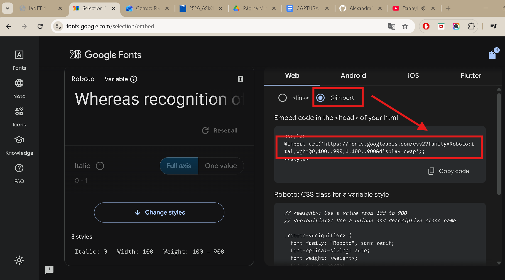 

-------
### Traslado del Enlace y Estilos al Documento HTML
#### 1. Enlazado de la Fuente
El código de enlace (`<link>`) que se obtiene de Google Fonts debe insertarse en el `<head>` del documento HTML. Esto carga la tipografía externa en la página.

#### 2. Creación del Bloque de Estilos
Directamente debajo del código de enlace, cree la etiqueta **`<style>`** dentro del `<head>` (tal como se ve en el ejemplo). Este bloque contendrá todas sus reglas CSS.

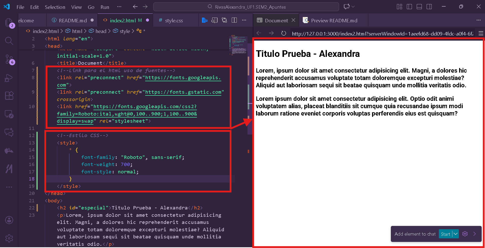 

-----

### Traslado del Enlace y Estilos al CSS


#### 1. Preparación del Enlace para Estilos

Antes de aplicar cualquier regla, si sus estilos residen en un archivo externo (ej. `style.css`), este debe estar correctamente **enlazado** en el `<head>` del documento HTML mediante la etiqueta `<link>`. Esta acción permite que el navegador lea el contenido de la hoja de estilos.

> *Nota: Si el estilo se realiza dentro de la etiqueta `<style>` en el HTML, esta debe estar presente y correctamente ubicada.*

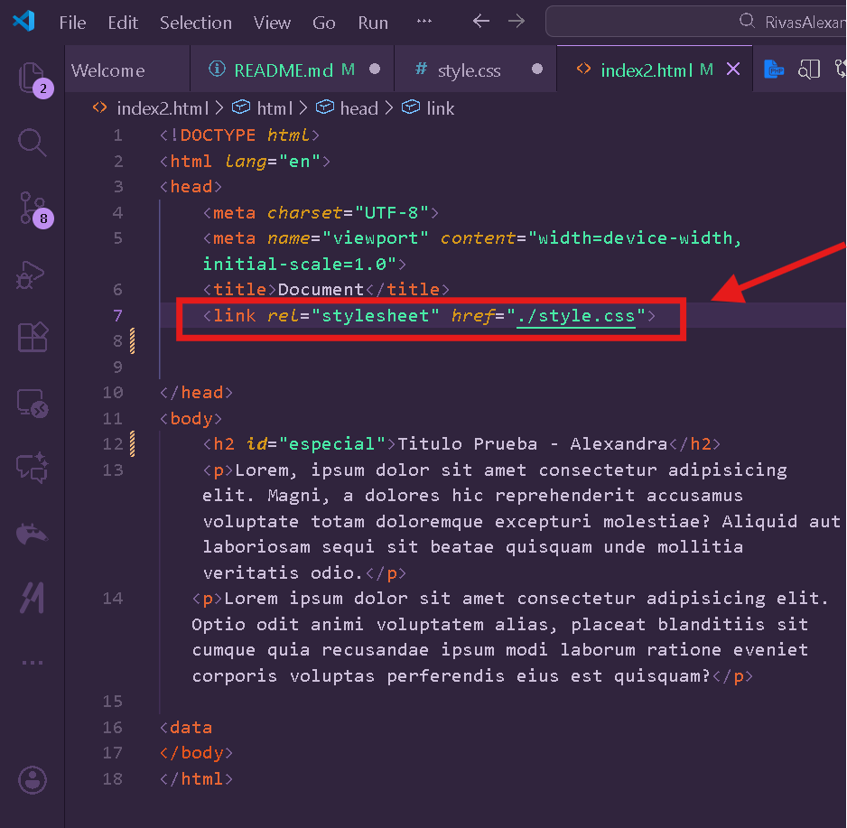 

--------

### 2. Invocación de la Tipografía
Si opta por este método de integración, la regla **`@import url(...)`** para cargar la fuente **debe ser la primera declaración absoluta** en el código CSS, precediendo a cualquier otra regla de estilo (como las definiciones de `h1`, `p`, o `.clase`).

Una vez asegurada la lectura del CSS, la fuente se activa utilizando la propiedad **`font-family`** dentro del selector correspondiente (ej. un selector de clase o de etiqueta). El valor de esta propiedad debe ser el nombre exacto de la fuente que fue previamente enlazada o importada (ej. Roboto).

### 3. Definición de Atributos

Complete la regla de estilo con las propiedades **`font-weight`** y **`font-style`** para definir el grosor y la inclinación, respectivamente, del texto. Estos atributos aseguran el uso de las variaciones específicas de la fuente.

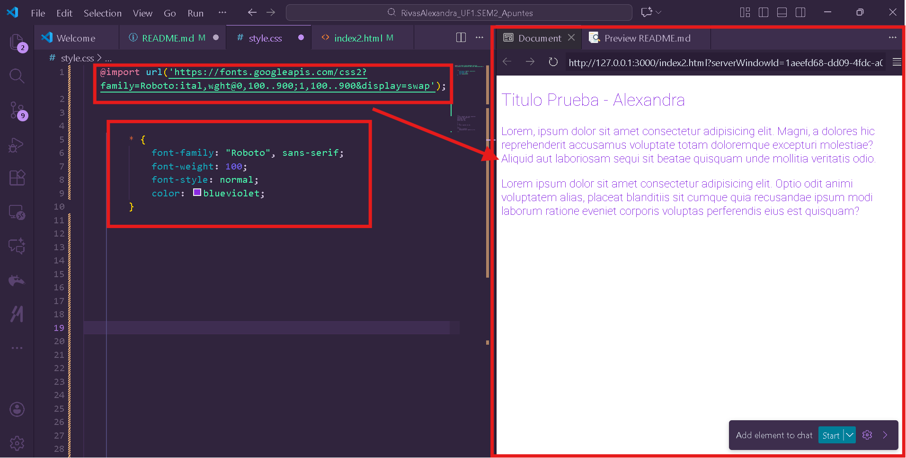 

-------
